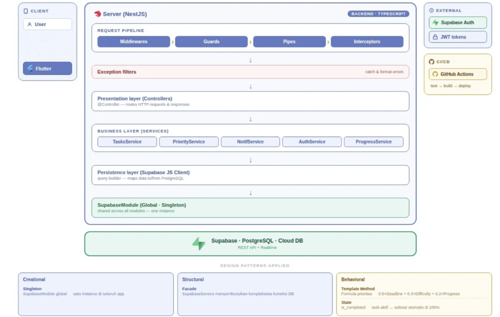

<p align="center">
     
</p>

<h1 align="center">PrioriTask</h1>
<p align="center"><b>Smart Task Management Mobile Application for University Students</b></p>

---

## Tentang PrioriTask

Mahasiswa masa kini sering menjalani lima mata kuliah atau lebih dalam satu semester, masing-masing dengan tugas, proyek, dan deadline sendiri-sendiri. Masalahnya bukan soal rajin atau tidak, melainkan **menentukan mana yang harus dikerjakan lebih dulu**. Aplikasi pencatat tugas yang umum dipakai (Notion, Google Tasks, dsb.) memperlakukan semua tugas secara setara, sehingga mahasiswa tetap harus memilah sendiri mana yang paling mendesak — proses yang menguras waktu dan energi.

**PrioriTask** hadir untuk menjawab persoalan ini. PrioriTask adalah aplikasi mobile yang membantu mahasiswa mencatat tugas akademik sekaligus **menghitung skor prioritas setiap tugas secara otomatis**, berdasarkan tiga variabel: kedekatan deadline, tingkat kesulitan, dan progres pengerjaan saat ini. Hasilnya, mahasiswa mendapat panduan objektif tentang apa yang harus dikerjakan berikutnya, tanpa perlu menebak-nebak sendiri.

Proyek ini dikembangkan sebagai tugas mata kuliah **Software Architecture** oleh Kelompok 8.

---

## Fitur Utama

- **Task Management** — Tambah, lihat, dan kelola seluruh tugas akademik dalam satu tempat, dikategorikan berdasarkan mata kuliah, tingkat kesulitan, dan status.
- **Automated Prioritization** — Skor prioritas tiap tugas dihitung otomatis berdasarkan deadline, tingkat kesulitan, dan progres pengerjaan, lalu diperbarui secara dinamis.
- **Progress Tracking** — Perbarui progres pengerjaan tugas secara visual lewat slider 0–100%, lengkap dengan riwayat catatan progres.
- **Notification System** — Pengingat otomatis untuk tugas yang mendekati deadline, supaya tidak ada yang terlewat.
- **Calendar View** — Tampilan kalender bulanan untuk melihat sebaran deadline secara sekilas.
- **Account Dashboard** — Ringkasan standing akademik (GPA & SKS) serta pengaturan tampilan dan notifikasi.

---

## Tampilan Aplikasi

<p align="center">
  
  
  
  
</p>

<p align="center">
  <i>Home — tugas prioritas utama &nbsp;•&nbsp; Daftar Tugas &nbsp;•&nbsp; Detail Tugas & Progress &nbsp;•&nbsp; Kalender</i>
</p>

---

## Tech Stack

| Komponen | Teknologi |
|---|---|
| Frontend | Flutter (Dart) |
| Backend | NestJS 10 (TypeScript) |
| Database | Supabase (PostgreSQL) |
| State Management | Provider Pattern |
| CI/CD | GitHub Actions |

---

## Struktur Folder

```
PrioriTask/
├── .github/
│   └── workflows/
│       ├── backend.yml          # CI/CD pipeline backend
│       └── frontend.yml         # CI/CD pipeline frontend
├── backend/                     # NestJS + TypeScript API
│   └── src/
│       ├── notifications/       # Modul notifikasi deadline
│       ├── priorities/          # Engine kalkulasi skor prioritas
│       ├── supabase/            # Koneksi & service Supabase (global module)
│       └── tasks/                # Modul tugas (CRUD, DTO)
└── frontend/                    # Flutter mobile app
    ├── assets/
    │   └── images/               # Logo, gambar onboarding, dsb.
    └── lib/
        ├── models/               # Model data (Task, Profile)
        ├── screens/              # Seluruh halaman UI
        ├── services/             # API service, auth, state provider
        ├── theme/                # Konfigurasi tema aplikasi
        └── widgets/              # Komponen UI reusable
```

---

## Menjalankan Project

### Backend

```bash
cd backend
npm install --legacy-peer-deps
npm run start:dev
```

Backend berjalan di `http://localhost:3000` dengan hot reload aktif. Detail environment variable ada di bagian [Environment Variables](#environment-variables) di bawah.

### Frontend

```bash
cd frontend
flutter pub get
flutter run
```

Pastikan Flutter SDK sudah terpasang ([panduan instalasi](https://docs.flutter.dev/get-started/install)) dan ada device/emulator yang aktif sebelum menjalankan `flutter run`.

---

## Detail Teknis Backend

<details>
<summary><b>Architecture</b> — klik untuk lihat detail</summary>

<br>

PrioriTask mengikuti pola arsitektur **Layered Architecture**, standar opinionated dari NestJS yang mendorong pemisahan tanggung jawab yang bersih antarlapis.

<p align="center">
  
</p>

- **Presentation Layer (Controllers)** — `@Controller`, menangani semua HTTP request masuk, memvalidasi input awal, dan mengirim response keluar. Tidak mengandung logika bisnis.
- **Business Layer (Services)** — Inti dari sistem. `TasksService`, `PriorityService`, `NotificationsService` berada di lapisan ini. Di sinilah formula prioritas dihitung dan aturan bisnis diterapkan.
- **Persistence Layer (Supabase JS Client)** — Query builder yang memetakan data ke dan dari PostgreSQL. Satu-satunya titik kontak dengan database.
- **Infrastructure Layer (SupabaseModule — Global Singleton)** — Modul global yang menyediakan koneksi ke Supabase dan di-share ke seluruh aplikasi.

**Alur request:**

```
HTTP Request → Middlewares → Guards → Pipes → Interceptors → Controller → Service → Supabase Client → PostgreSQL
```

Exception filters menangkap dan memformat error yang muncul di titik manapun sepanjang alur ini, memastikan response error yang konsisten ke semua client.

</details>

<details>
<summary><b>Database Schema</b> — klik untuk lihat detail</summary>

<br>

Database menggunakan **PostgreSQL** yang di-host di Supabase dengan dua tabel utama:

**Tabel `tasks`**

| Kolom | Tipe | Keterangan |
|---|---|---|
| `id` | UUID | Primary key, di-generate otomatis |
| `subject_name` | TEXT | Nama mata kuliah |
| `task_name` | TEXT | Nama tugas |
| `description` | TEXT | Deskripsi detail tugas |
| `difficulty` | TEXT | Tingkat kesulitan: `easy`, `medium`, `hard` |
| `deadline` | TIMESTAMPTZ | Batas waktu pengumpulan tugas |
| `progress_percent` | NUMERIC(5,2) | Persentase progress (0–100) |
| `is_completed` | BOOLEAN | Status selesai atau belum |
| `created_at` | TIMESTAMPTZ | Waktu tugas dibuat |
| `updated_at` | TIMESTAMPTZ | Waktu terakhir diupdate (auto-update via trigger) |

**Tabel `progress_updates`**

| Kolom | Tipe | Keterangan |
|---|---|---|
| `id` | UUID | Primary key |
| `task_id` | UUID | Foreign key ke tabel `tasks` (cascade delete) |
| `note` | TEXT | Catatan progress dari user |
| `progress_percent` | NUMERIC(5,2) | Persentase progress saat update dilakukan |
| `image_url` | TEXT | URL gambar bukti progress (opsional) |
| `created_at` | TIMESTAMPTZ | Waktu update dibuat |

**Relasi**

```
tasks (1) ──────── (many) progress_updates
         ON DELETE CASCADE
```

Saat sebuah task dihapus, semua progress update yang terkait akan otomatis ikut terhapus.

**Database Trigger**

Tabel `tasks` memiliki trigger `tasks_updated_at` yang otomatis memperbarui kolom `updated_at` setiap kali ada perubahan data, tanpa perlu dilakukan secara manual dari aplikasi.

</details>

<details>
<summary><b>API Endpoints</b> — klik untuk lihat detail</summary>

<br>

Base URL: `http://localhost:3000` (development) atau URL deployment kamu (production)

### Tasks

#### GET `/tasks`
Mengambil semua tugas beserta skor prioritas masing-masing.

**Response:**
```json
[
  {
    "id": "uuid",
    "subject_name": "Kalkulus",
    "task_name": "Tugas Integral Lipat",
    "description": "Kerjakan soal integral lipat dua dan tiga",
    "difficulty": "hard",
    "deadline": "2026-05-20T23:59:00.000Z",
    "progress_percent": 30,
    "is_completed": false,
    "created_at": "2026-05-18T10:00:00.000Z",
    "priority_score": 92.5,
    "progress_updates": []
  }
]
```

---

#### GET `/tasks/:id`
Mengambil detail satu tugas berdasarkan ID beserta seluruh riwayat progress updatenya.

**Response:** sama dengan objek task di atas, dengan `progress_updates` berisi array riwayat update.

---

#### POST `/tasks`
Membuat tugas baru.

**Request Body:**
```json
{
  "subject_name": "Kalkulus",
  "task_name": "Tugas Integral Lipat",
  "description": "Kerjakan soal integral lipat dua dan tiga",
  "difficulty": "hard",
  "deadline": "2026-05-20T23:59:00.000Z"
}
```

**Validasi:**
- `subject_name` — wajib, string
- `task_name` — wajib, string
- `description` — opsional, string
- `difficulty` — wajib, hanya boleh `easy`, `medium`, atau `hard`
- `deadline` — wajib, format ISO 8601 date string

**Response:** `201 Created` dengan objek task yang baru dibuat.

---

#### PATCH `/tasks/:id`
Mengupdate data tugas yang sudah ada. Semua field bersifat opsional.

**Request Body (semua opsional):**
```json
{
  "subject_name": "Kalkulus Lanjut",
  "progress_percent": 75,
  "is_completed": false
}
```

Catatan: jika `progress_percent` diset ke 100, maka `is_completed` akan otomatis menjadi `true`.

**Response:** `200 OK` dengan objek task yang sudah diupdate.

---

#### DELETE `/tasks/:id`
Menghapus tugas beserta seluruh progress update-nya (cascade delete).

**Response:** `204 No Content`

---

### Progress Updates

#### GET `/tasks/:id/progress`
Mengambil seluruh riwayat progress update dari satu tugas, diurutkan dari yang terbaru.

**Response:**
```json
[
  {
    "id": "uuid",
    "task_id": "uuid",
    "note": "Sudah selesai bagian integral substitusi",
    "progress_percent": 50,
    "image_url": null,
    "created_at": "2026-05-18T14:30:00.000Z"
  }
]
```

---

#### POST `/tasks/:id/progress`
Menambahkan progress update baru untuk suatu tugas. Secara otomatis juga mengupdate kolom `progress_percent` di tabel `tasks`.

**Request Body:**
```json
{
  "progress_percent": 50,
  "note": "Sudah selesai bagian integral substitusi",
  "image_url": "https://example.com/foto.jpg"
}
```

**Validasi:**
- `progress_percent` — wajib, angka 0–100
- `note` — opsional, string
- `image_url` — opsional, string URL

**Response:** `201 Created` dengan objek progress update yang baru dibuat.

---

### Priority Score

#### GET `/tasks/:id/priority`
Menghitung dan mengembalikan skor prioritas dari satu tugas berdasarkan kondisi terkini (deadline, kesulitan, progress).

**Response:**
```json
{
  "score": 92.5
}
```

---

### Notifications

#### GET `/notifications`
Mengambil maksimal 3 tugas yang paling mendesak untuk dijadikan notifikasi, yaitu tugas yang deadlinenya dalam 3 hari ke depan dan belum selesai, diurutkan dari yang paling dekat deadlinenya.

**Response:**
```json
[
  {
    "id": "uuid",
    "task_id": "uuid",
    "task_name": "Tugas Integral Lipat",
    "subject_name": "Kalkulus",
    "deadline": "2026-05-19T23:59:00.000Z",
    "priority_score": 92.5,
    "message": "Tugas \"Tugas Integral Lipat\" deadline dalam 18 jam!",
    "is_overdue": false,
    "hours_left": 18
  }
]
```

</details>

<details>
<summary><b>Formula Kalkulasi Prioritas</b> — klik untuk lihat detail</summary>

<br>

Ini adalah inti logika bisnis PrioriTask. Setiap tugas memiliki **skor prioritas** yang dihitung secara dinamis berdasarkan tiga faktor, diimplementasikan di `src/priorities/priority.service.ts`.

### Formula

```
Score = (0.5 × DeadlineFactor) + (0.3 × DifficultyFactor) + (0.2 × ProgressFactor)
```

### Penjelasan Setiap Faktor

**1. DeadlineFactor (bobot 50%)**

Faktor ini mengukur seberapa mendesak deadline tugas. Semakin sedikit waktu tersisa, semakin tinggi nilainya.

```
hoursLeft      = jam tersisa hingga deadline
DeadlineFactor = 100 × (1 - hoursLeft / 168)
```

- Horizon maksimum adalah **168 jam (7 hari)**. Tugas dengan deadline lebih dari 7 hari dianggap tidak terlalu mendesak.
- Jika tugas sudah **melewati deadline** (hoursLeft ≤ 0), nilai otomatis menjadi **100** (maksimum urgency).
- Contoh: sisa 84 jam → `100 × (1 - 84/168)` = **50**

**2. DifficultyFactor (bobot 30%)**

Faktor ini mencerminkan tingkat kesulitan tugas. Tugas yang lebih sulit diprioritaskan lebih tinggi karena membutuhkan lebih banyak waktu pengerjaan.

| Difficulty | Nilai |
|---|---|
| `easy` | 33.3 |
| `medium` | 66.7 |
| `hard` | 100.0 |

**3. ProgressFactor (bobot 20%)**

Faktor ini mengukur seberapa banyak pekerjaan yang belum diselesaikan. Tugas yang belum dikerjakan sama sekali diprioritaskan lebih tinggi.

```
ProgressFactor = 100 - progress_percent
```

- Progress 0% → ProgressFactor = 100 (belum dikerjakan sama sekali)
- Progress 50% → ProgressFactor = 50 (setengah jalan)
- Progress 100% → ProgressFactor = 0 (selesai, skor akan menjadi 0)

### Contoh Kalkulasi Nyata

Tugas dengan kondisi:
- Deadline 2 hari lagi (48 jam)
- Difficulty: `hard`
- Progress: 30%

```
DeadlineFactor  = 100 × (1 - 48/168)  = 71.43
DifficultyFactor = 100 (hard)
ProgressFactor  = 100 - 30            = 70

Score = (0.5 × 71.43) + (0.3 × 100) + (0.2 × 70)
      = 35.71 + 30 + 14
      = 79.71
```

Skor ini kemudian dibandingkan antar semua tugas aktif untuk menentukan urutan prioritas di aplikasi.

</details>

<details>
<summary><b>Environment Variables</b> — klik untuk lihat detail</summary>

<br>

File `.env` di root folder `backend/` perlu diisi sebelum menjalankan backend:

```env
SUPABASE_URL=https://xxxx.supabase.co
SUPABASE_ANON_KEY=your_anon_key_here
SUPABASE_SERVICE_ROLE_KEY=your_service_role_key_here
PORT=3000
NODE_ENV=development
ALLOWED_ORIGINS=http://localhost:3000,http://localhost:8080
```

Cara mendapatkan nilai-nilai di atas:
1. Login ke [supabase.com](https://supabase.com)
2. Buka project kamu
3. Pergi ke **Settings → API**
4. Copy **Project URL** → `SUPABASE_URL`
5. Copy **anon public** → `SUPABASE_ANON_KEY`
6. Copy **service_role** → `SUPABASE_SERVICE_ROLE_KEY`

</details>

<details>
<summary><b>CI/CD (GitHub Actions)</b> — klik untuk lihat detail</summary>

<br>

File `.github/workflows/backend.yml` menjalankan pipeline otomatis setiap kali ada push ke branch `main` atau `develop` pada folder `backend/`.

**Tahapan Pipeline**

1. **Job `test`** (berjalan di semua push dan pull request) — checkout kode, setup Node.js 20, install dependencies, jalankan linter (`eslint`), jalankan unit test (`jest`), build TypeScript ke JavaScript.
2. **Job `deploy`** (hanya berjalan saat push ke `main`) — hanya berjalan jika job `test` berhasil. Siap dikonfigurasi untuk deploy ke **Railway** atau **Render**.

**GitHub Secrets yang Dibutuhkan**

Tambahkan di **repository → Settings → Secrets and variables → Actions:**

| Secret | Keterangan |
|---|---|
| `SUPABASE_URL` | URL project Supabase |
| `SUPABASE_ANON_KEY` | Anon key Supabase |
| `RAILWAY_TOKEN` | Token Railway (jika pakai Railway) |
| `RENDER_DEPLOY_HOOK_URL` | Deploy hook Render (jika pakai Render) |

</details>

<details>
<summary><b>Offline Fallback</b> — klik untuk lihat detail</summary>

<br>

Backend dirancang agar **tidak crash** saat Supabase tidak tersambung. Jika kredensial Supabase tidak ditemukan atau koneksi gagal, sistem akan:

1. Menampilkan warning di console
2. Mengembalikan **data dummy** berisi contoh tugas mahasiswa
3. Tetap menjalankan semua kalkulasi prioritas secara normal

Ini memungkinkan pengembangan dan testing frontend berjalan tanpa memerlukan koneksi database aktif.

</details>

---

## Tim Pengembang — Kelompok 8

| Nama | Peran |
|---|---|
| Stawin Revano | Project Manager + Backend |
| Gilbert Nicholin | Backend + Frontend |
| Nabil Rafif Utomo | Frontend |
| Roderikus Orvin Nevanto | Frontend |
| Sindy Aulia Putri Hendrawan | Frontend |

---
