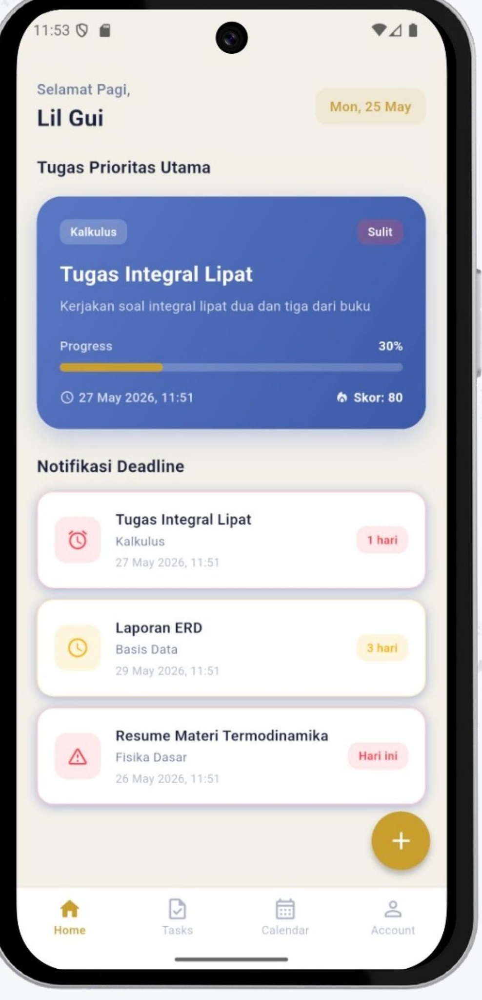
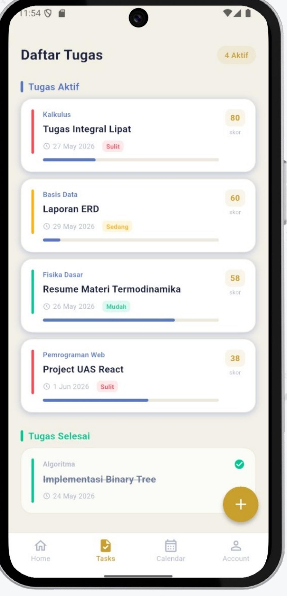
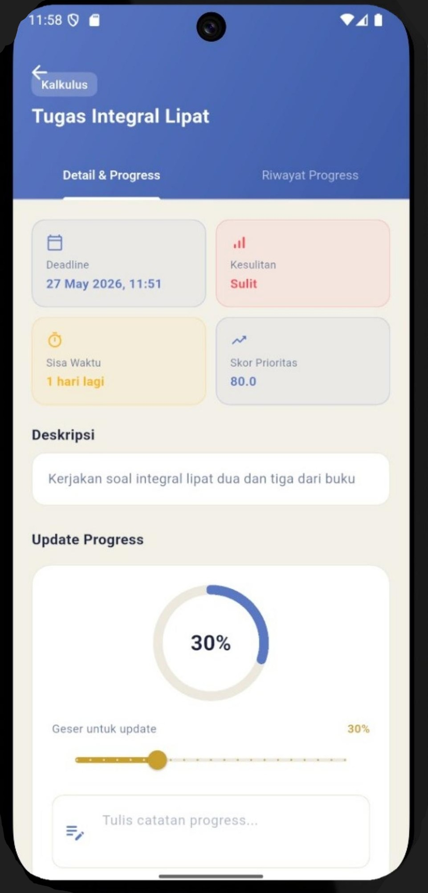
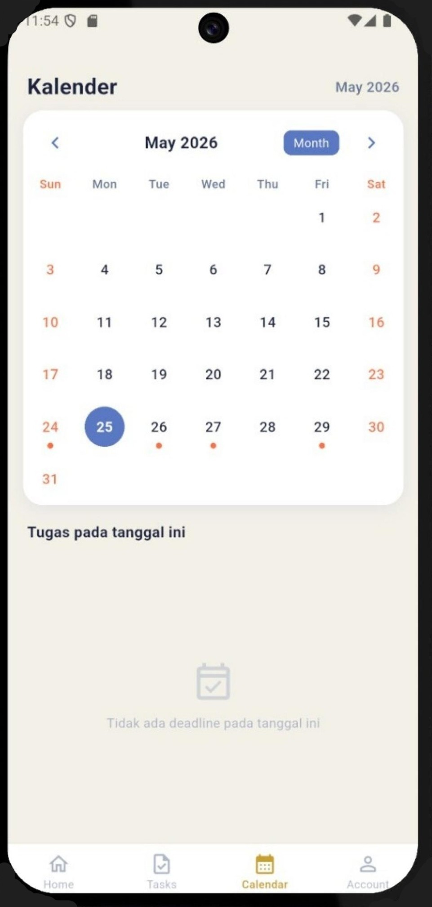

<p align="center">
     
</p>

<h1 align="center">PrioriTask</h1>
<p align="center"><b>Smart Task Management Mobile Application for University Students</b></p>

---

## Tentang PrioriTask

Mahasiswa masa kini sering menjalani lima mata kuliah atau lebih dalam satu semester, masing-masing dengan tugas, proyek, dan deadline sendiri-sendiri. Masalahnya bukan soal rajin atau tidak, melainkan **menentukan mana yang harus dikerjakan lebih dulu**. Aplikasi pencatat tugas yang umum dipakai (Notion, Google Tasks, dsb.) memperlakukan semua tugas secara setara, sehingga mahasiswa tetap harus memilah sendiri mana yang paling mendesak — proses yang menguras waktu dan energi.

**PrioriTask** hadir untuk menjawab persoalan ini. PrioriTask adalah aplikasi mobile yang membantu mahasiswa mencatat tugas akademik sekaligus **menghitung skor prioritas setiap tugas secara otomatis**, berdasarkan tiga variabel: kedekatan deadline, tingkat kesulitan, dan progres pengerjaan saat ini. Hasilnya, mahasiswa mendapat panduan objektif tentang apa yang harus dikerjakan berikutnya, tanpa perlu menebak-nebak sendiri.

Proyek ini dikembangkan sebagai tugas mata kuliah **Software Architecture** oleh Kelompok 8.

---

## Fitur Utama

- **Task Management** — Tambah, lihat, dan kelola seluruh tugas akademik dalam satu tempat, dikategorikan berdasarkan mata kuliah, tingkat kesulitan, dan status.
- **Automated Prioritization** — Skor prioritas tiap tugas dihitung otomatis berdasarkan deadline, tingkat kesulitan, dan progres pengerjaan, lalu diperbarui secara dinamis.
- **Progress Tracking** — Perbarui progres pengerjaan tugas secara visual lewat slider 0–100%, lengkap dengan riwayat catatan progres.
- **Notification System** — Pengingat otomatis untuk tugas yang mendekati deadline, supaya tidak ada yang terlewat.
- **Calendar View** — Tampilan kalender bulanan untuk melihat sebaran deadline secara sekilas.
- **Account Dashboard** — Ringkasan standing akademik (GPA & SKS) serta pengaturan tampilan dan notifikasi.

---

## Tampilan Aplikasi

<p align="center">
  
  
  
  
</p>

<p align="center">
  <i>Home — tugas prioritas utama &nbsp;•&nbsp; Daftar Tugas &nbsp;•&nbsp; Detail Tugas & Progress &nbsp;•&nbsp; Kalender</i>
</p>

---

## Tech Stack

| Komponen | Teknologi |
|---|---|
| Frontend | Flutter (Dart) |
| Backend | NestJS 10 (TypeScript) |
| Database | Supabase (PostgreSQL) |
| State Management | Provider Pattern |
| CI/CD | GitHub Actions |

---

## Struktur Folder

```
PrioriTask/
├── .github/
│   └── workflows/
│       ├── backend.yml          # CI/CD pipeline backend
│       └── frontend.yml         # CI/CD pipeline frontend
├── backend/                     # NestJS + TypeScript API
│   └── src/
│       ├── notifications/       # Modul notifikasi deadline
│       ├── priorities/          # Engine kalkulasi skor prioritas
│       ├── supabase/            # Koneksi & service Supabase (global module)
│       └── tasks/                # Modul tugas (CRUD, DTO)
└── frontend/                    # Flutter mobile app
    ├── assets/
    │   └── images/               # Logo, gambar onboarding, dsb.
    └── lib/
        ├── models/               # Model data (Task, Profile)
        ├── screens/              # Seluruh halaman UI
        ├── services/             # API service, auth, state provider
        ├── theme/                # Konfigurasi tema aplikasi
        └── widgets/              # Komponen UI reusable
```

> Dokumentasi lengkap masing-masing bagian tersedia di README terpisah:
> - [`backend/README.md`](backend/README.md) — setup, API endpoints, formula kalkulasi prioritas, environment variables, dan CI/CD.

---

## Menjalankan Project

### Backend

```bash
cd backend
npm install --legacy-peer-deps
npm run start:dev
```

Backend berjalan di `http://localhost:3000`. Detail environment variable dan konfigurasi Supabase ada di [`backend/README.md`](backend/README.md).

### Frontend

```bash
cd frontend
flutter pub get
flutter run
```

Pastikan Flutter SDK sudah terpasang ([panduan instalasi](https://docs.flutter.dev/get-started/install)) dan ada device/emulator yang aktif sebelum menjalankan `flutter run`.

---

## Tim Pengembang — Kelompok 8

| Nama | Peran |
|---|---|
| Stawin Revano | Project Manager + Backend |
| Gilbert Nicholin | Backend + Frontend |
| Nabil Rafif Utomo | Frontend |
| Roderikus Orvin Nevanto | Frontend |
| Sindy Aulia Putri Hendrawan | Frontend |

---

## Batasan & Rencana Pengembangan

Versi saat ini adalah **MVP (Minimum Viable Product)** dan memiliki beberapa batasan yang disadari sejak awal:

- Belum ada sistem autentikasi pengguna (data tugas masih bersifat global).
- Notifikasi masih bersifat *pull-based* (diambil saat aplikasi dibuka), belum berupa push notification.
- Upload gambar bukti progres belum tersedia di UI meski sudah didukung di skema database.

Rencana pengembangan berikutnya mencakup autentikasi via Supabase Auth (JWT), push notification dengan Firebase Cloud Messaging, fitur kolaborasi tugas kelompok, serta dashboard analitik produktivitas.
